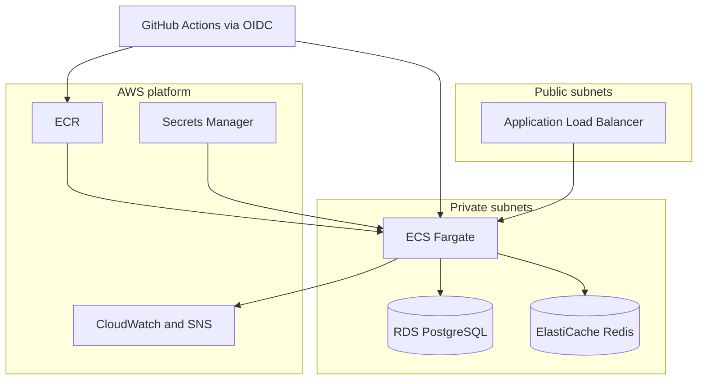

# AuthForge

## Summary

AuthForge is a from-scratch OAuth 2.0 / OpenID Connect identity provider — not a wrapper around Auth0 or Cognito. It implements Authorization Code + PKCE, RS256 JWTs with automated key rotation, Argon2id password hashing with TOTP MFA, and refresh-token rotation with reuse detection. The service runs on AWS (ECS Fargate, RDS PostgreSQL, ElastiCache Redis) with infrastructure defined in Terraform and a GitHub Actions pipeline that deploys to staging via OIDC (no long-lived AWS keys).

## Architecture



Traffic enters through the ALB, terminates on ECS Fargate tasks (desired count ≥ 2 in staging), and reaches PostgreSQL for durable state and Redis for ephemeral state (sessions, auth codes, rate limits). Container images live in ECR; signing keys, database credentials, and other secrets are pulled from Secrets Manager. Terraform provisions VPC, subnets, security groups, and all of the above. CI builds and pushes images, runs `terraform apply`, and smoke-tests staging — authenticated to AWS with GitHub OIDC, not static access keys.

## Validated results

These were measured or confirmed against **live staging**, not unit tests alone.

**Refresh-token rotation under real concurrency**

- 90 token families, 5-way simultaneous contention per family
- 450 total HTTP requests
- 360 expected reuse attempts correctly rejected (400 `invalid_grant`)
- 90 correct winners (200 + rotated token)
- Zero unexpected failures

**Three security controls validated end-to-end**

1. **Refresh-token reuse detection** — replaying a consumed refresh token returns 400; `refresh_reuse_detected` audit event and CloudWatch alarm `authforge-staging-refresh-reuse-detected` transition OK → ALARM.
2. **Account-level brute-force throttle** — fires at attempt 11 against a configured 10 attempts / 300s per-account limit; `login_failure` and `rate_limit_exceeded` events confirmed in CloudWatch logs.
3. **IP-level brute-force throttle** — fires at attempt 31 against a configured 30 attempts / 300s per-IP limit; `rate_limit_exceeded` with `login_ip` scope confirmed in CloudWatch logs.

**CI/CD**

- Merge to lint-tested → built → deployed → smoke-tested staging in **under 7 minutes**, using GitHub OIDC for AWS authentication.

## Tech stack

| Layer | Technology |
|-------|------------|
| Application | Python 3.12, FastAPI |
| Durable state | PostgreSQL |
| Ephemeral state | Redis |
| Cloud | AWS — ECS Fargate, RDS, ElastiCache, ALB, ECR, Secrets Manager, CloudWatch, SNS |
| Infrastructure | Terraform |
| Packaging | Docker |
| CI/CD | GitHub Actions |
| Load testing | k6 |

## Local development

**Prerequisites:** Docker, [uv](https://docs.astral.sh/uv/), and Make (Git Bash on Windows).

```bash
make install    # virtualenv + dev dependencies
make up         # Postgres, Redis, IdP (http://localhost:8000)
make migrate    # apply Alembic migrations
make seed       # scopes, signing key, admin user, demo OAuth client
```

Common targets (run `make help` for the full list):

| Target | Purpose |
|--------|---------|
| `make up` / `make down` / `make clean` | Start, stop, or reset the local stack |
| `make logs` | Tail IdP container logs |
| `make migrate` / `make migration` | Apply or autogenerate migrations |
| `make seed` | Bootstrap local scopes, keys, admin, demo client |
| `make test` / `make test-unit` / `make test-integration` | Run pytest suites |
| `make lint` / `make format` | Ruff + mypy checks, or auto-fix |
| `make coverage` | Pytest with ≥80% coverage gate |
| `make smoke` | Hit `/health`, `/ready`, discovery, JWKS locally |
| `make demo` | Start demo relying party (:8100) and resource server (:8200) |
| `make build` | Build the production Docker image |

Staging one-offs (`make migrate-staging`, `make bootstrap-keys-staging`, `make seed-loadtest-staging`) use `scripts/run-ecs-oneoff.sh` against the deployed Fargate task definition.

## Technical specification

The full design document — scope, protocols, data models, security model, infrastructure, and implementation phases — lives at **[docs/SPEC.md](docs/SPEC.md)**. Out-of-scope decisions and trade-offs are in [§31](docs/SPEC.md#31-complexity-guardrails-and-key-trade-offs).

## Known limitations

- **Token-exchange load-test regression.** After a Redis client tuning change (pool cap, split connect/command timeouts), the sustained token-exchange k6 run went from **0.33%** to **2.85%** `http_req_failed` at the same scale (15 VUs / 45s). Burst CPU credit depletion, deploy overlap, and connection-pool exhaustion were each investigated via CloudWatch and ruled out; the root cause is **not yet conclusively identified**.
- **Browser login on staging HTTP.** Session and flow cookies are marked `Secure`, but the staging ALB currently serves plain HTTP only — real browsers refuse to store or send those cookies, so `/login` and `/consent` do not work interactively. The fix path is already in the Terraform ALB module (`enable_https` + `certificate_arn`); it has not been enabled yet.
- **SNS notifications.** CloudWatch alarms (including refresh-reuse detection) fire correctly, but the SNS topic has **no subscribers**, so no email or chat notification is delivered yet.

## Deliberately out of scope

| Item | Why |
|------|-----|
| **Multi-tenancy / organizations** | Adds tenant isolation, billing, and admin surfaces beyond a single-purpose authorization server; scope stays on protocol correctness and security depth. |
| **Social login / external IdP federation** | Would make this a broker, not a standalone IdP; dilutes the goal of owning the full auth stack. |
| **Open dynamic client registration (RFC 7591)** | Anonymous registration opens abuse vectors (client flooding, spoofing); clients are registered by an authenticated admin instead ([§31](docs/SPEC.md#31-complexity-guardrails-and-key-trade-offs)). |
| **Implicit and hybrid OAuth flows** | Excluded per OAuth 2.0 Security BCP; effort goes into Authorization Code + PKCE done correctly ([§31](docs/SPEC.md#31-complexity-guardrails-and-key-trade-offs)). |
| **Multi-region deployment** | Replication and failover complexity disproportionate to a portfolio-scale project; single-region is an explicit trade-off ([§31](docs/SPEC.md#31-complexity-guardrails-and-key-trade-offs)). |
